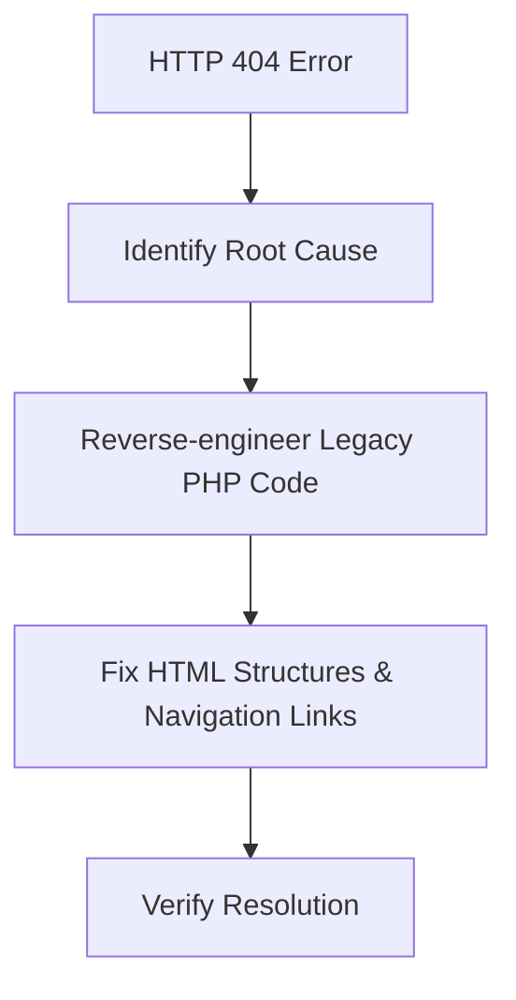

## Overview

Resolved HTTP 404 errors in a legacy PHP application by reverse-engineering undocumented code and fixing HTML structures and navigation links.

## Troubleshooting Workflow

## Tech Stack

* **Backend:** PHP
* **Web:** HTML
